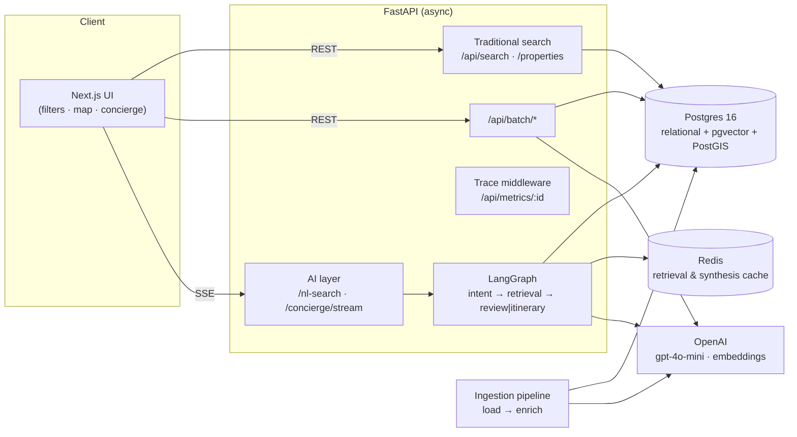

# AI-Native Travel Discovery

A booking product (Booking.com / Airbnb-style filters, map, listings, reviews)
with an AI brain underneath: natural-language search, a multi-agent concierge,
review synthesis with citations, and itinerary planning — over 50K+ listings and
200K+ reviews across multiple cities.

## Live demo

- **Web:** `<fill after deploy>`
- **API:** `<fill after deploy>` (`/docs`, `/health`)

See [DEPLOY.md](DEPLOY.md) for the deploy paths (Render + Vercel, or a single
VPS with docker-compose).

## One-command local run

```bash
cp .env.example .env            # set OPENAI_API_KEY (and CITIES)
make up                         # db (postgis+pgvector) + redis + api
make seed                       # ingest ./data/<city>/*.csv.gz  (one-off)
# API:    http://localhost:8000/docs
# Health: http://localhost:8000/health
```

Download two cities from [Inside Airbnb](https://insideairbnb.com/get-the-data/)
into `./data/lisbon/` and `./data/barcelona/` (`listings`, `calendar`, `reviews`).
The pipeline reads either the gzipped downloads (`*.csv.gz`) or already
decompressed `*.csv` files.

> **Ingest cost guardrail.** Review summaries are the only per-listing LLM cost.
> `SUMMARY_MAX_LISTINGS` (default `2000` in `.env.example`) bounds a demo seed to
> the most-reviewed listings; set `0` for a full run (every listing with ≥3
> reviews). Embeddings cover all listings and are cheap (~$0.40 at this scale).

## Architecture



Hybrid retrieval runs **filters + cosine similarity (`<=>`) + geo distance
(`ST_Distance`) in one SQL statement** — no shuffling candidates between stores.

## Repository layout

```
ingestion/   re-runnable load + enrich pipeline (Stage/Pipeline pattern)
api/         FastAPI: traditional endpoints + LangGraph concierge + SSE
docker/      db image (postgis + pgvector), backend image
web/         Next.js frontend
docker-compose.yml · Makefile · schema.sql
```

## Data choice
Real data from Inside Airbnb (preferred option), two cities — **Lisbon (~54.6K
listings) and Barcelona (~46.9K listings) for ~101.5K listings and well over 1M
reviews**, comfortably clearing the 50K listings / 200K reviews floor. The
ingestion pipeline is fully re-runnable
and idempotent (`COPY` into staging → `ON CONFLICT` upsert), with four
enrichments: amenity normalization and neighbourhood price percentile (free,
deterministic), listing embeddings, and precomputed per-property review
summaries + aspect scores.

## Key trade-offs (and choices deliberately NOT made)
- **One Postgres, no dedicated vector DB.** At this scale pgvector + HNSW is
  ample, and co-locating vectors with relational + geo data enables single-query
  hybrid retrieval. We did *not* add Qdrant/Pinecone — that's operational
  overhead this workload doesn't need.
- **Listing embeddings only; no per-review embeddings.** Semantic search runs on
  listings; review intelligence reads precomputed summaries. Per-review vectors
  are a later add if review-level semantic search is needed.
- **Review summaries precomputed at ingest**, not at serve time — the detail page
  and AI layer read a cached column, keeping per-request cost low.
- **Calendar windowed** to the next 12 months to bound table size and keep
  availability filtering fast.
- **gpt-4o-mini everywhere** — cheap structured extraction and synthesis; swap
  the synthesis model up if quality demands it (one env var).

## Cost per query (back-of-envelope)
A fresh concierge query: intent parse (~$0.0002) + query embedding (~$0) + review
synthesis (~$0.0006) ≈ **$0.001–0.002**. Itinerary queries add ~$0.001. Redis
caching on parsed intent and candidate-id sets drops repeats toward intent-only
(~$0.0002), and travel queries cluster heavily, so real-world average is lower.

## What we'd change with another week
- Per-review embeddings + a reranker for review-level semantic search.
- A small offline eval harness wired into CI (see `EVAL.md`).
- Token-level streaming of the final answer (currently per-agent-step streaming).
- Map-bounds-driven search (bbox) and marker clustering tuning.

## Observability
Every request carries an `X-Request-Id`. `GET /api/metrics/{id}` returns token
usage, latency, and the full agent step trace for that request.

## Time spent
_~XX hours (fill in actual)._ Scope deliberately bounded to stay within 48h:
- Demo seed caps review summaries via `SUMMARY_MAX_LISTINGS` (full-corpus
  summarization is ~$15–50 and 1–3h); embeddings still cover every listing.
- Listing embeddings only (no per-review vectors); review intelligence reads
  precomputed per-property summaries.
- Single photo per listing (Inside Airbnb ships one `picture_url`).
- Laptop-first responsive only, per the brief.
