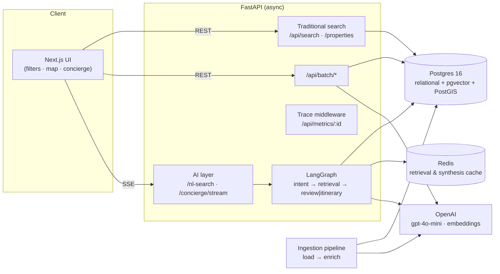

# wayfare Travel Discovery

An AI-enhanced, booking-style travel discovery application that combines the familiar experience of a modern accommodation platform with an intelligent travel concierge.

Users can browse listings through structured filters, an interactive map, property pages, reviews, availability, and comparison tools. The AI layer adds natural-language search, review synthesis with source citations, and multi-stop itinerary planning without replacing the core booking experience with a chat-only interface.

The application is built on real [Inside Airbnb](https://insideairbnb.com/get-the-data/) data for **Lisbon and Barcelona**, covering approximately **101,500 listings** and **more than 1 million reviews**.

## Live Demo

| Service | URL |
|---|---|
| Web application | https://wayfare-ai-travel.vercel.app/ |
| API documentation | https://wayfare-ai-travel.onrender.com/docs |
| API health check | https://wayfare-ai-travel.onrender.com/health |

The frontend is deployed on **Vercel**, and the backend is deployed on **Render**. See [DEPLOY.md](DEPLOY.md) for the complete Render and Vercel deployment process, as well as an alternative single-VPS deployment using Docker Compose.

## Product Highlights

### Booking Experience

- Structured search by dates, guests, price, rating, property type, and amenities
- Multiple sorting options
- Synchronized listing and MapLibre map views
- Listing highlighting during map hover and movement
- Property detail pages with availability and pricing information
- Filterable guest reviews
- Wishlist support
- Side-by-side property comparison with an AI-generated verdict
- Mock reservation flow

### AI Experience

- Natural-language accommodation search
- Visible conversion of free-text requirements into structured filter chips
- LangGraph-based conversational concierge
- Review synthesis with citations to the underlying reviews
- Multi-stop itinerary generation
- Server-Sent Events for live agent-step streaming
- Request-level token, latency, and agent-trace observability

## Run Locally

### One-command environment setup

```bash
cp .env.example .env                     # Set OPENAI_API_KEY and, optionally, CITIES
make up                                  # Start Postgres, Redis, and the API
make seed                                # Ingest ./data/<city>/*.csv.gz once
docker compose --profile web up -d web   # Start the frontend at http://localhost:3000

# API documentation: http://localhost:8000/docs
# Health check:      http://localhost:8000/health
```

### Prepare the data

Download the `listings`, `calendar`, and `reviews` datasets for both cities from [Inside Airbnb](https://insideairbnb.com/get-the-data/) and place them in the following directories:

```text
data/
├── lisbon/
│   ├── listings.csv.gz
│   ├── calendar.csv.gz
│   └── reviews.csv.gz
└── barcelona/
    ├── listings.csv.gz
    ├── calendar.csv.gz
    └── reviews.csv.gz
```

The ingestion pipeline supports both compressed `*.csv.gz` files and already decompressed `*.csv` files.

An optional audit and cleanup step can be run before ingestion:

```bash
python scripts/clean_data.py
```

> **Ingestion cost guardrail**
>
> Review summaries are the only per-listing LLM cost during ingestion. `SUMMARY_MAX_LISTINGS`, which defaults to `2000` in `.env.example`, limits a demo seed to the most-reviewed listings. Set it to `0` to summarize every listing that has at least three reviews.
>
> Listing embeddings are still generated for the complete corpus and cost approximately **$0.40** at this scale.

## Architecture



Hybrid retrieval combines the following operations in **one SQL statement**:

- Structured filters
- Vector cosine similarity using `<=>`
- Geographic distance using `ST_Distance`

This avoids moving or reshuffling candidates between a relational database and a separate vector store.

## How the Five Required Layers Work Together

### 1. Data Layer

A re-runnable ingestion pipeline follows a `schema → load → enrich` flow and loads the Inside Airbnb datasets into a single PostgreSQL engine with **pgvector** and **PostGIS**.

The ingestion process applies four enrichments:

1. Amenity normalization
2. Neighbourhood price-percentile calculation
3. Listing embedding generation
4. Precomputed review summaries and aspect scores

The pipeline stages are idempotent and can be re-run safely:

```text
schema → load_listings → load_calendar → load_reviews
       → percentile → embeddings → review_summary
```

Bulk loads use `COPY` into staging tables followed by `ON CONFLICT` upserts. Enrichment stages skip rows that have already been processed unless the pipeline is run with `--force`.

See [INGESTION_README.md](INGESTION_README.md) for pipeline details and tuning options.

### 2. Booking Product Surface

The application is designed as a real booking and discovery product, not as a chat wrapper.

The main product experience includes:

- Date, guest, price, rating, property-type, and amenity filters
- Search sorting
- A listing view synchronized with a MapLibre map
- Hover and map-pan synchronization
- Property detail pages
- AI-generated review summaries
- Aspect-score bars
- Filterable reviews
- Availability calendars
- Price breakdowns
- A mock **Reserve** flow
- Wishlists
- Side-by-side property comparison
- AI-generated comparison verdicts

See [web/WEB_README.md](web/WEB_README.md) for the frontend pages, components, and design details.

### 3. AI Layer

The natural-language search bar converts free-text requests into structured filters and updates the filter chips visibly so that users can inspect what the system understood.

For more complex requests, a four-agent LangGraph concierge uses the following flow:

```text
intent → retrieval → review synthesis or itinerary generation
```

The graph supports conditional routing between review-oriented and itinerary-oriented requests. Agent progress is streamed to the frontend through **Server-Sent Events**, and citations link users to both the relevant listing and the underlying review.

### 4. Backend Layer

The backend uses **FastAPI** with a fully asynchronous implementation.

It provides:

- Traditional property and search endpoints
- Natural-language search
- Streaming concierge responses
- Batch property comparison and summary endpoints
- Redis caching for repeated retrieval and synthesis operations
- Per-request token, latency, and agent-step tracing

Request metrics are available through:

```http
GET /api/metrics/{id}
```

See [api/API_README.md](api/API_README.md) for endpoint details, agent behavior, and cache design.

### 5. Frontend and Deployment

The frontend uses **Next.js 14** with custom branding rather than a Bootstrap-style template.

A concierge dock is available throughout the application and streams agent progress over SSE from any page. The backend is deployed on Render, while the frontend is deployed on Vercel.

> **Current scope**
>
> The searchable corpus contains only Lisbon and Barcelona. The Dubai example in the assignment brief will therefore not return real inventory. I intentionally focused on delivering a strong, credible two-city implementation rather than fabricating a third dataset.

## Data Selection and Storage Design

### Why I Used Real Data

I selected the assignment's preferred real-data option rather than generating synthetic inventory:

| City | Approximate listings |
|---|---:|
| Lisbon | 54,600 |
| Barcelona | 46,900 |
| **Total** | **101,500** |

The combined dataset also contains well over **1 million reviews**, comfortably exceeding the assignment minimum of **50,000 listings** and **200,000 reviews**.

### Why PostgreSQL Handles Relational, Vector, and Geo Workloads

At approximately 100,000 listings, **pgvector with an HNSW index** is sufficient for semantic retrieval. Keeping vectors, structured listing data, calendar availability, and `GEOGRAPHY` values in one database allows semantic similarity, filters, and geographic distance to remain part of the same SQL query.

I deliberately avoided adding a separate vector database because it would introduce extra infrastructure and candidate synchronization without providing a meaningful benefit at the current scale.

## Why LangGraph and OpenAI

### LangGraph

LangGraph was selected because the application required:

- Explicit agent steps that users can see while they run
- Conditional routing between review and itinerary workflows
- Typed graph state
- A trace reducer shared by the SSE stream and `/api/metrics/{id}`
- Clear orchestration without hand-written workflow glue

A LangGraph `StateGraph` made these requirements straightforward to implement and inspect.

### OpenAI

The AI layer uses:

- `gpt-4o-mini` for structured extraction and synthesis
- `text-embedding-3-small` for listing and query embeddings

Structured Outputs are used for intent parsing and review-summary generation. At approximately 100,000 listings, full-corpus embedding generation costs around **$0.40**.

The synthesis model can be upgraded through the `SYNTHESIS_MODEL` environment variable without changing application code.

### Hallucination Control and Citation Safety

The review agent receives an explicit `id → review text` mapping and is instructed to cite only IDs included in that context. The serving layer also removes any citation that does not match an allowed review ID.

This provides two levels of protection:

1. Prompt-level citation constraints
2. Post-generation citation validation

Evaluation methodology and citation-validity measurements are documented in [EVAL.md](EVAL.md).

## Important Engineering Trade-offs

### One PostgreSQL Database Instead of a Dedicated Vector Store

At the current scale, pgvector with HNSW provides sufficient retrieval performance. I did not add Qdrant or Pinecone because the workload does not yet justify the additional operational complexity.

### Listing Embeddings Instead of Per-review Embeddings

Semantic search currently operates on listing embeddings. Review intelligence reads precomputed summaries rather than embedding every review.

Per-review embeddings would be the next logical extension if the product required review-level semantic search.

### Review Summaries Generated During Ingestion

Review summaries are computed during ingestion rather than at request time. Property pages and AI workflows read the stored summary column, which keeps user-facing latency and per-request LLM cost low.

### Windowed Calendar Data

`CALENDAR_DAYS` defaults to `7` to keep the calendar table compact and availability filtering fast. The window can be increased when longer booking horizons are required.

### Limited Demo Summary Generation

`SUMMARY_MAX_LISTINGS=2000` limits LLM-generated summaries during a demo seed. Full-corpus review summarization is estimated to cost approximately **$15–$50** and take **1–3 hours**. Embeddings are still generated for all listings.

### One Listing Photo

Inside Airbnb provides a single `picture_url` per listing. The property page therefore uses a framed hero image rather than presenting an artificial multi-image carousel.

### Laptop-first Responsiveness

The application is responsive and usable on a laptop, but the 48-hour scope did not include a fully mobile-perfect implementation.

## Estimated AI Cost

### Per Concierge Query

A fresh concierge request is approximately:

| Operation | Estimated cost |
|---|---:|
| Intent parsing | ~$0.0002 |
| Query embedding | Approximately $0 |
| Review synthesis | ~$0.0006 |
| **Typical total** | **~$0.001–$0.002** |

An itinerary request adds approximately **$0.001**.

Redis caches parsed intents and candidate ID sets. Repeated requests can therefore approach intent-only cost, approximately **$0.0002**. Travel searches also tend to cluster around similar locations and constraints, so the expected real-world average should be lower than the uncached estimate.

### One-time Ingestion Cost

- Full-corpus listing embeddings: approximately **$0.40**
- Review summaries: dependent on `SUMMARY_MAX_LISTINGS`
- Full-corpus review summarization estimate: approximately **$15–$50**

## Evaluation

The evaluation harness measures the following automatically:

- Intent accuracy
- Constraint adherence
- Citation validity
- Latency
- Token usage

Faithfulness and response relevance are reviewed manually against a small golden dataset.

Run the evaluation suite with:

```bash
API_URL=http://localhost:8000 python -m eval.run_eval
```

The current golden set contains eight queries. The complete evaluation approach is documented in [EVAL.md](EVAL.md).

## Observability

Every request includes an `X-Request-Id`.

The following endpoint returns the request's token usage, latency, and complete agent-step trace:

```http
GET /api/metrics/{id}
```

The same trace reducer feeds both the live SSE experience and the metrics endpoint, keeping user-visible execution steps aligned with backend observability.

## What I Would Improve With Another Week

- Add per-review embeddings and a reranker for review-level semantic retrieval
- Integrate the evaluation harness into CI with a stored baseline
- Expand the golden evaluation set from 8 queries to approximately 50–100
- Add token-level streaming for the final generated answer; the current implementation streams one agent step at a time
- Add map-bounds-driven search using a bounding box
- Improve marker-clustering behavior and tuning
- Extend the production calendar window when longer availability searches are required

## Scope and Time Management

The implementation took approximately **42 hours** and was deliberately scoped to remain within the assignment's 48-hour limit.

The main scope controls were:

- Review-summary generation capped through `SUMMARY_MAX_LISTINGS`
- Full-corpus summarization deferred because it would cost approximately $15–$50 and take 1–3 hours
- Embeddings still generated for every listing
- Listing-level embeddings used instead of per-review vectors
- Review intelligence powered by precomputed property summaries
- A single real `picture_url` used per listing
- Laptop-first responsiveness prioritized over mobile-perfect polish

These choices preserve a complete working product slice while keeping the architecture ready for the next level of scale and quality.

## Repository Structure

```text
ingestion/   Re-runnable load and enrichment pipeline using the Stage/Pipeline pattern
api/         FastAPI endpoints, LangGraph concierge, batch operations, and SSE
docker/      PostgreSQL/PostGIS/pgvector image and backend image
web/         Next.js frontend
eval/        Golden queries and automated agent-quality evaluation harness
scripts/     Optional CSV auditing and cleanup utilities

docker-compose.yml
Makefile
schema.sql
```

## Further Reading

- [INGESTION_README.md](INGESTION_README.md) — ingestion stages and performance tuning
- [api/API_README.md](api/API_README.md) — endpoints, agents, tracing, and caching
- [web/WEB_README.md](web/WEB_README.md) — frontend pages, features, and design
- [DEPLOY.md](DEPLOY.md) — Render, Vercel, and single-VPS deployment
- [EVAL.md](EVAL.md) — evaluation methodology and AI quality measurements
